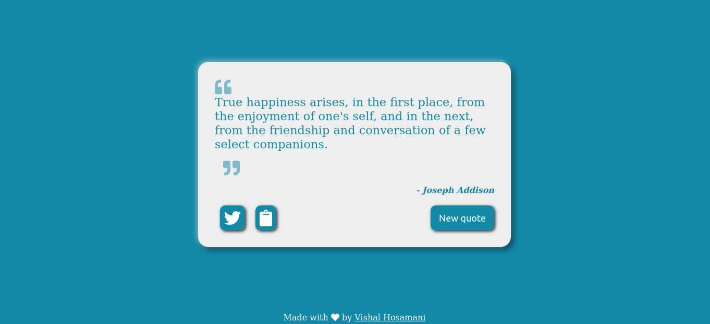
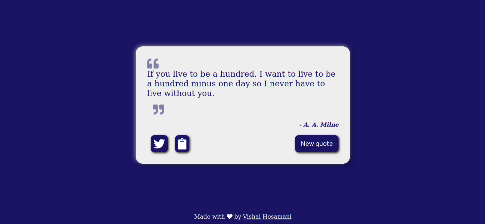
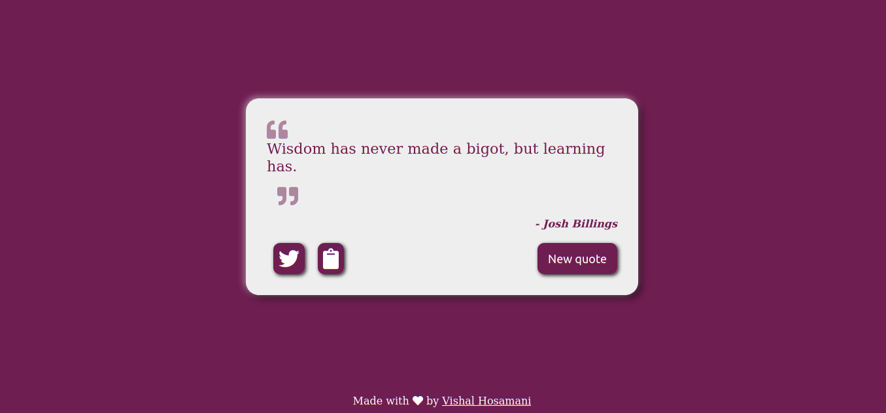

# Quotes Generator

##Sections
 - [DEMO](#demo)
 - [FEATURES](#features)
 - [TECHNOLOGIES USED](#technologies-used)
 - [DETAILS](#details)

## Demo
You can try the generator yourself: [here](https://vshalt.github.io/quotes-generator)  or
https://vshalt.github.io/quotes-generator

## Features
- Random quotes pulled from an API
- One click away from sharing to twitter
- Mobile friendly
- Responsive page
- Copy to clipboard with a click
- Dynamically changing background color
- New quotes are a click away

## Technologies used
- JavaScript
- HTML
- CSS
- API from quotable (https://quotable.io/random)

## Details
* This project is made with the use of plain HTML, CSS, JavaScript.
* Quotes are pulled from https://quotable.io/random and are displayed on the page.
* New background color with every new quote.
* Share on twitter, or copy to clipboard to share with others.
